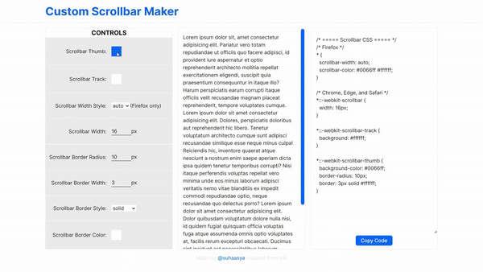

## Demo



## How to run the app locally?

```
$ git clone https://github.com/suhaasya/custom-scrollbar-maker.git
$ cd banker
$ npm install
$ npm run dev
```

## Features

- Home Page with options of modifying all the properties of Scrollbar and copy CSS.

## Tech Stack and Tools

- React with Typescript
- Git For Version Control
- vercel for Deployment

## Live Link

[Custom Scrollbar Maker](http://custom-scrollbar-maker.vercel.app/)
